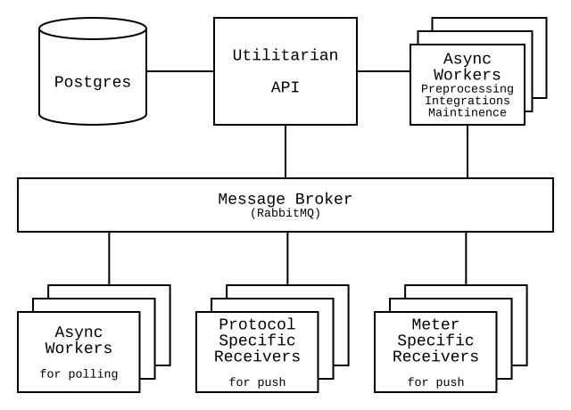

# Architecture

*Utilitarian is a multi utility AMR system built for the Cloud.*
 
 
 
 

## Multi utility

Utilitarian is built to manage any energy type, meter and  communications 
protocol.  

## Scalable

Utilitarian is a decentralized system that can be deployed across as many 
servers as needed to fit your use case.

By using a message broker workloads are split across asynchronous worker 
processes for time consuming like polling for meter data. Workers can be 
scaled independently for fit your load.

Receiving of push meter data is made in separate services that can all be 
individually scaled for the needed load. 

## Reliable

Several instances can be run of every service and they can be run in different 
environments, for example if you want to split load between different data 
centers or availability zones Utilitarian does not limit you.

Services can be load balanced using standard technologies. 

The main points of failure are the Postgres database and the RabbitMQ message 
broker, but these risks can be mitigated using High Availability (HA) setups 
and standard database reliability techniques.

## Secure

Depending on internal and regulatory requirements you can run Utilitarian with 
a range of security levels and settings so that you can find the best fit for 
your organization.

## Configurable

You can just run the services needed for your specific use case.

## Open

Utilitarian is designed to enable users to easily build their own integrations 
and subsystems if needed. It is possbile to hook into the message streams from 
any application using the message payload documentation.

Utilitarian is built using open source technologies and libraries. We have also 
open sourced many of our own libraries that we use within Utilitarian. 
